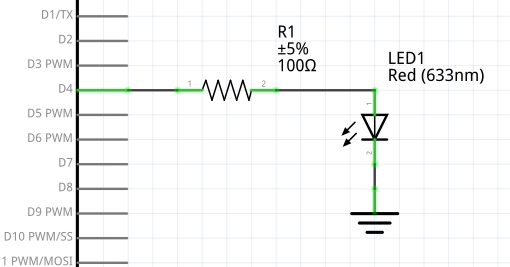
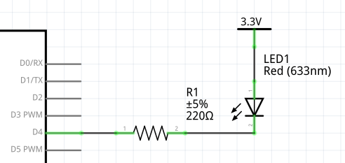

# Architecture materielle

lien vers le [cours](https://sen.enst.fr/se302a-se302b/architecture-materielle)

Auteur: _Vincent Gaillard_

### Exercice 1
Pour piloter une LED par le GPIO d'un microcontrolleur, on peut utiliser le shema suivant:

Pour calculer la valeur de la resistance, voici la procedure.
```
* Calculer Umax, la tension maximale aux bornes de la resistance.
* On sait que U + Uled = Ud4
* Soit Umax = Ud4_max - Uled_min
* On a donc Umax = 3.3 - 2.3 = 1V
* Or U = R * I
* Sachant que l'on cherche a maximiser I (Imax = 10mA) sans ne jamais exceder cette valeur, on va utiliser Umax et Imax pour calculer R
* D'ou R = Umax / Imax = 1 / 10^-2 = 100 ohm
```
**R = 100 ohm**
### ----

Le shema doit etre modifie etant donne qu une tension d'alimentation doit etre utilisee:

```
* On sait que U + Uled = 3.3 - Ud4
* Soit Umax = 3.3 - Ud4_min - Uled_min
* On a donc Umax = 3.3 - 0 - 2.3 = 1V
* Or U = R * I
* Sachant que l'on cherche a maximiser I (Imax = 6mA) sans ne jamais exceder cette valeur, on va utiliser Umax et Imax pour calculer R
* D'ou R = Umax / Imax = 1 / 0.06 = 166 ohm
* Prenons R = 220 ohm pour utiliser une valeur standard.
```
**R = 220 ohm**
