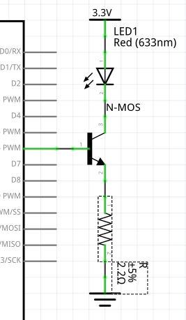

# Architecture materielle

lien vers le [cours](https://sen.enst.fr/se302a-se302b/architecture-materielle)

Auteur: _Vincent Gaillard_

### Exercice 1
Pour piloter une LED par le GPIO d'un microcontrolleur, on peut utiliser le shema suivant:

Pour calculer la valeur de la resistance, voici la procedure.

* Calculer Umax, la tension maximale aux bornes de la resistance.
* On sait que U + Uled = Ud4
* Soit Umax = Ud4_max - Uled_min
* On a donc Umax = 3.3 - 2.3 = 1V
* Or U = R * I
* Sachant que l'on cherche a maximiser I (Imax = 10mA) sans ne jamais exceder cette valeur, on va utiliser Umax et Imax pour calculer R
* D'ou R = Umax / Imax = 1 / 10^-2 = 100 ohm

**R = 100 ohm**
### ----

Le shema doit etre modifie etant donne qu une tension d'alimentation doit etre utilisee:

* On sait que U + Uled = 3.3 - Ud4
* Soit Umax = Vcc - Ud4_min - Uled_min
* On a donc Umax = 3.3 - 0 - 2.3 = 1V
* Or U = R * I
* Sachant que l'on cherche a maximiser I (Imax = 6mA) sans ne jamais exceder cette valeur, on va utiliser Umax et Imax pour calculer R
* D'ou R = Umax / Imax = 1 / 0.06 = 166 ohm
* Prenons R = 220 ohm pour utiliser une valeur standard

**R = 220 ohm**
### ----

Si le courant maximum est de 4mA mais que la LED supporte jusqu'a 500mA, il est preferable d'utiliser des parties puissance et commande.

Premiere etape: determiner la valeur de R1
* On sait que Ud4 = R1 * I1
* Soit R1 = Ud4 / I1
* On souhaite dimensionner R pour limiter I1 (I1_max = 4mA)
* R1 = Ud4_min / I1_max
* On sait que Ud4_min est la tension de seuil du transistor (Ud4_min = 0.6V)
* D'ou R1 = 0.6 / 0.04 = 15 ohm

**R1 = 15 ohm**

Deuxieme etape: determiner la valeur de R2
* On sait que Vcc = R2 * I2 + Uled
* Soit R2 = (Vcc - Uled) / I2
* On souhaite dimensionner R pour limiter I2 (I2_max = 500mA)
* R2 = (Vcc - Uled_min) / I1_max
* On sait que Uled_min est la tension de seuil de la LED (Uled_min = 2.3V)
* D'ou R2 = (3.3 - 2.3) / 0.5 = 2 ohm
* Prenons R2 = 2.2 ohm pour utiliser une valeur standard

**R2 = 2.2 ohm**

### Exercice 2
