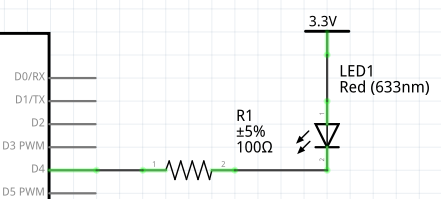

# Architecture materielle

lien vers le [cours](https://sen.enst.fr/se302a-se302b/architecture-materielle)

Auteur: _Vincent Gaillard_

### Exercice 1
Pour piloter une LED par le GPIO d'un microcontrolleur, on peut utiliser le shema suivant:

Pour calculer la valeur de la resistance, voici la procedure.

* Calculer U_max, la tension maximale aux bornes de la resistance.
* On sait que U + Uled = Ud4
* Soit U_max = Ud4_max - Uled_min
* On a donc U_max = 3.3 - 2.3 = 1V
* Or U = R * I
* Sachant que l'on cherche a maximiser I (I_max = 10mA) sans ne jamais exceder cette valeur, on va utiliser U_max et I_max pour calculer R
* D'ou R = U_max / I_max = 1 / 10^-2 = 100 ohm

**R = 100 ohm**
### ----

Le shema doit etre modifie etant donne qu une tension d'alimentation doit etre utilisee.
Aussi, il faut que l'intensité dans le GPIO soit negative pour ne pas limiter l'intensite dans la LED par le GPIO.

* On sait que U + Uled = 3.3 - Ud4
* Soit U_max = Vcc - Ud4_min - Uled_min
* On a donc U_max = 3.3 - 0 - 2.3 = 1V
* Or U = R * I
* Sachant que l'on cherche a maximiser I sans ne jamais exceder I_max (= max(|-15|, 10) = 10mA), on va utiliser U_max et I_max pour calculer R
* D'ou R = U_max / I_max = 1 / 0.01 = 100 ohm

**R = 100 ohm**
### ----

Si le courant maximum du GPIO est de 4mA mais que la LED supporte jusqu'a 500mA, il est preferable d'utiliser des parties puissance et commande.

Il faut determiner la valeur de R
* On sait que Vcc = R * I + Uled
* Soit R = (Vcc - Uled) / I
* On souhaite dimensionner R pour limiter I (I_max = 500mA)
* R = (Vcc - Uled_min) / I_max
* On sait que Uled_min est la tension de seuil de la LED (Uled_min = 2.3V)
* D'ou R = (3.3 - 2.3) / 0.5 = 2 ohm
* Prenons R = 2.2 ohm pour utiliser une valeur standard

**R = 2.2 ohm**

### Exercice 2

Pour faire un reset a l'etat bas, on peut brancher le reset a un bouton poussoir lui meme relie a la masse, puis ajouter une resistance de pull up.

## Exercice 3
