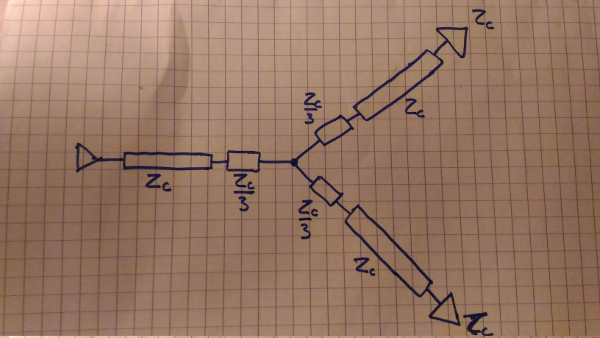
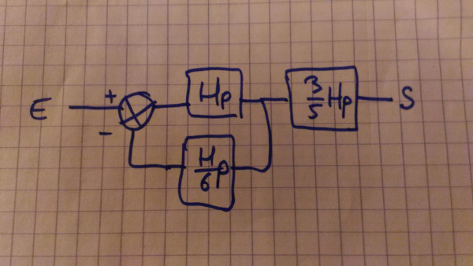

# Exercise: Intégrité du signal

### Premier tronçon

On a, pour le premier tronçon:  
Zs = 0  
Zl = Zc/3 + Z  
Z = Z2 / 2 = (Zc/3+Zc+Zc) / 2 = 7 \* Zc / 6  
Zl = 3 / 2 \* Zc  
On a donc
* A_1 = 1
* R1_1 = -1
* R2_1 = 1 / 6
* T_1 = 3 / 2

### Deuxième tronçon

On a, pour le deuxieme troncon:  
Zs = Zc/3 + Z = 3 / 2 \* Zc  
Zl = Zc  
On a donc:
* A_2 = 2 / 5
* R1_2 = 1 / 6
* R2_2 = 0
* T_2 = 1

### Mise en commun

Notons H le gain obtenu dans la ligne.  
On se retrouve avec un système de la sorte:

Avec:
* F1 = H
* F2 = R1_1 \* H \* R1_2 = 1 / 6 \* H \* p
* F3 = T_1 \* A_2 \* H \* p = 3 / 5 \* H \* p

*p* correspond au temps que le signal met pour transiter dans la ligne.

On obtient donc ce systeme:

On reconnait un système qui oscille.  
Les souvenirs de prépa reviennent et m'affolent.
